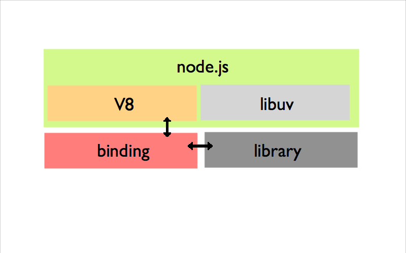
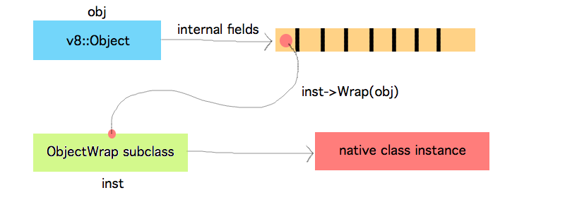

Build the C link
================================
.. class:: subtitle

    Nikhil Marathe

.. raw:: pdf

    PageBreak cutePage

Introduction
------------

* V8 is a powerful, **fast** JavaScript engine
* It is self contained and easy to embed

      JS is the new Lua?

* node.js is a thin wrapper around V8 and evented I/O (*libuv*)

Follow along
------------

Slides and code
\
\
\

    git clone git://github.com/nikhilm/jsfoo-pune-2012.git

We want to
------------

.. role:: large

\

\

\

\

\

\

:large:`Use C/C++ libraries in node.js`
\

\

\

:large:`Exchange data between C++ ⇔ JS`
\

\

\

:large:`Do asynchronous I/O`

Getting started
---------------

.. code-block:: cpp
    :include: firststep/firststep.cc

Build
-----

.. code-block:: python
    :include: firststep/wscript

Run
---

.. code-block:: bash

    $ node-waf configure build
    ...
    'build' finished successfully (0.327s)

    $ node

.. code-block:: js

    > require('./build/Release/firststep')
    {}

Architecture
------------

.. [#] you **will** need http://bespin.cz/~ondras/html/index.html

Handles
-----------

* Think of them as **smart pointers**, GCed by V8
* Also encode scope (Use `HandleScope` to manage handles)
* Local - GCed as they go out of scope::

    Local<String> name; // also Handle<...>

* Persistent - Must be manually disposed::

    Persistent<String> globalVariable;

Injecting primitives
--------------------

.. code-block:: cpp
    :include: primitives/primitives.cc

Simple functions
----------------

\
\
\
\
.. code-block:: js

    exports.square = function(n) {
        return n * n;
    }

\
We want to do this in C++

Simple functions
----------------

Registering with V8:

.. code-block:: cpp
    :include: simplefunctions/main.cc
    :start-at: Handle<Value>
    :end-before: {

.. code-block:: cpp
    :include: simplefunctions/main.cc
    :start-at: static void
    :end-before: NODE_MODULE

Simple functions
----------------

Implementation:

.. code-block:: cpp
    :include: simplefunctions/main.cc
    :start-at: Handle
    :end-at: }

explain scope.Close

Templates
---------

.. code-block:: JS

    FunctionTemplate                            ???

    FunctionTemplate::GetFunction               square [Function]

    FunctionTemplate::InstanceTemplate()        What `this` would be in 'new square()'

    FunctionTemplate::PrototypeTemplate()       square.prototype

Simple objects
--------------

\
\
\

.. code-block:: js

    exports.Inventory = function() {
        this.items = 257;
    }

    // later
    var iv = new Inventory();
    console.log(iv.items);

This is the classic object oriented JS style

Simple objects
--------------

.. code-block:: cpp
    :include: simpleobject/main.cc
    :start-at: static void Init
    :end-before: NODE_MODULE

.. code-block:: cpp
    :include: simpleobject/main.cc
    :start-at: Handle<Value>
    :end-at: }

Methods
-------

.. code-block:: js

    Inventory.prototype.addStock = function(newStock) {
        this.items += newStock;
    }

    Inventory.prototype.ship = function(orders) {
        if (this.items < orders)
            throw Exception("Not enough items");

        this.items -= orders
    }

Methods
-------

Registering prototype methods

.. code-block:: cpp
    :include: methods/main.cc
    :start-at: // operating
    :end-at: GetFunction());

Methods
-------

Accessing object properties

.. code-block:: cpp
    :include: methods/main.cc
    :start-at: Handle<Value> AddStock
    :end-at: }

Methods
-------

Throwing an exception

.. code-block:: cpp
    :include: methods/main.cc
    :start-at: Handle<Value> Ship
    :end-at: }

ObjectWrap
----------

* Associate native C++ objects with JS objects
* Node specific class which manages garbage collection
* Stored internally in fields

\
\

ObjectWrap
----------

.. code-block:: cpp

    // native C++ class
    namespace Library {
    class Inventory {
        Inventory();
        void addStock(int);
        int ship(int);
        int getItems();

        int items; // private
    };
    }

ObjectWrap
----------

Setting internal field count

.. code-block:: cpp
    :include: objectwrap/main.cc
    :start-at: Handle<ObjectTemplate>
    :end-at: Count(1);

ObjectWrap
----------

Wrapping

.. code-block:: cpp
    :include: objectwrap/main.cc
    :start-at: namespace binding
    :end-at: }

ObjectWrap
----------

Unwrapping

.. code-block:: cpp
    :include: objectwrap/main.cc
    :start-at: static Handle<Value> Ship
    :end-at: }

Going Async
-----------

* The easiest way is to use `uv_queue_work()`
* Every async call requires a set of 3 functions
    1. Set up and invoke `uv_queue_work()`
    2. Do blocking task (run in separate thread)
    3. Clean up (run in main thread)
* Use a 'baton' to pass around data
    * `uv_request_t` is used by `libuv`
    * But it's `data` field is important to store the baton itself
* Slightly cumbersome :(

Going Async
-----------

.. code-block:: js
    :include: async/test.js

Going Async
-----------

The native blocking code (method of class `Library::Inventory`)

.. code-block:: cpp
    :include: async/main.cc
    :start-at: void reshelve
    :end-at: }

Going Async
-----------

The baton

.. code-block:: cpp
    :include: async/main.cc
    :start-at: struct ReshelveBaton
    :end-at: }

Going Async
-----------

JS callback

.. code-block:: cpp
    :include: async/main.cc
    :start-at: static Handle<Value> Reshelve
    :end-at: }

Going Async
-----------

Thread pool function

.. code-block:: cpp
    :include: async/main.cc
    :start-at: static void ReshelveAsync
    :end-at: }

Going Async
-----------

Clean up

.. code-block:: cpp
    :include: async/main.cc
    :start-at: static void ReshelveAsyncAfter
    :end-before: private

Going Async
-----------

Output

.. code-block:: txt

    After reshelve in source
    Tick
    Tick
    Tick
    Tick
    Reshelving done

Linking your library
--------------------

Linking external libs in Waf:

.. code-block:: python

    def configure(conf):
      # ...
      # uses pkg-config
      conf.check_cfg(package='<pkg-config name>', args='--cflags --libs',
      uselib_store='ALIAS')

    def build(bld):
      # ...
      obj.uselib = 'ALIAS'

Holder vs This
--------------

* `args.This()` is always the this object passed in to the function

* `args.Holder()` runs up the prototype chain to the 'right' object

* Signatures decide the 'right' object, automatically handled by
  `NODE_PROTOTYPE_SET_METHOD`

* **Always** use `Holder()` to be on the safe side

Things I haven't covered
------------------------

* Accessors
    * Per property accessors
    * Indexed accessors ( `object[5]` )
    * Named property accessors ( `object.property` )
* Function Signatures and HasInstance for type safety
* Emitting events using new JS only EventEmitter
* Details of libuv
* Using V8 on its own

You might want to look at
-------------------------

* https://github.com/weaver/uuidjs
* https://github.com/nikhilm/node-taglib
* https://github.com/pietern/hiredis-node

End notes
-----------

Contact:

* `@nikhilcutshort <https://twitter.com/nikhilcutshort>`_
* nsm.nikhil@gmail.com

\
\
\
`Cover image <http://www.flickr.com/photos/32045022@N05/3006326562/>`_ by `Munjal Savla <http://www.flickr.com/people/32045022@N05/>`_ (*by-nc-sa*)

Extra material below
---------------------

Calling JS functions
--------------------

.. code-block:: js
    :include: calljs/test.js

Calling JS functions
--------------------

.. code-block:: cpp
    :include: calljs/main.cc
    :start-at: Handle<Value>
    :end-before: extern

Strings to-and-fro
------------------

v8::String -> C string

.. code-block:: cpp
    :include: strings/main.cc
    :start-after: v8;
    :end-before: Handle<Value> Read

Strings to-and-fro
------------------

C string -> v8::String

.. code-block:: cpp
    :include: strings/main.cc
    :start-at: Handle<Value> Read
    :end-at: }
